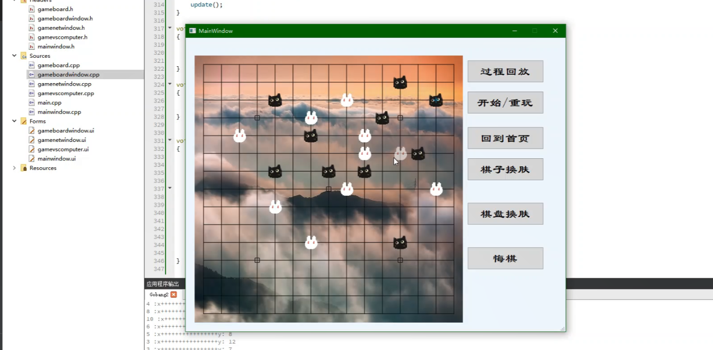

# 五子棋对战（二人、网络、人机、悔棋、过程回放）
&ensp;&ensp;&ensp;&ensp;这是使用QT实现的一个五子棋对战系统。实现了双人线下对战、使用计分表法实现人机对战、基于客户端服务器的网络对战（仅仅实现了线上二人对战，只需要将客户端源码上的IP设置为服务端的IP就能在两台不同的机器上进行联机对战） 
&ensp;&ensp;&ensp;&ensp;亮点是实现了棋子换肤功能、棋盘换肤功能、以及过程回放(过程回放的设定是玩家在下棋的过程中对自己之前的下棋过程有疑问，就可以点击过程回放按钮，在棋盘中复现自己和对手下棋的过程，过程回放结束后还能继续下棋) 
&ensp;&ensp;&ensp;&ensp;存在的一个bug就是过程回放之前不能点击悔棋，否则过程回放完成之后窗口就会异常退出就不能继续下棋 
&ensp;&ensp;&ensp;&ensp;效果如下： 

